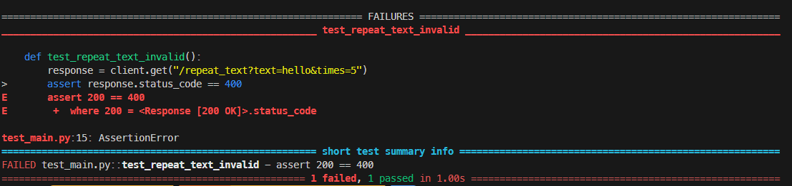
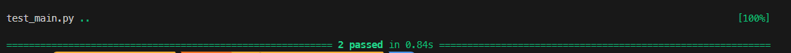
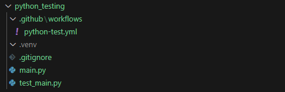
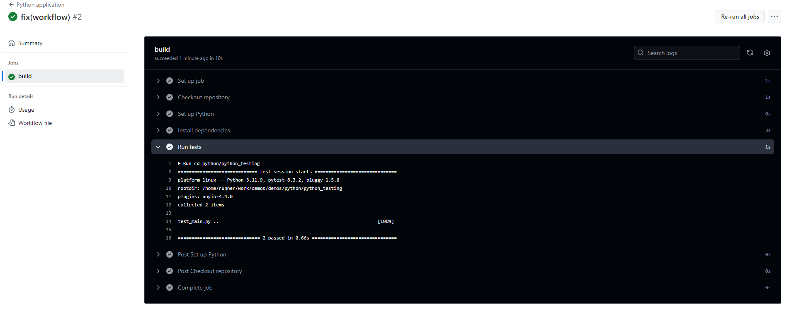

### Todays topic: Testing, but fun!

Testing is one of the unbeloved actions of software engineering, but let me tell you: If you start early it will be less tedious to get into it later on.

I got some easy tips for you to setup your projects with testing automation

<!-- truncate -->

## Python

I will be using [FastAPI](https://fastapi.tiangolo.com/) to create this backend. There might be a post about FastAPI somewhere, but today we will only use it to show you how testing works in a python backend.

### Prequisites

- Python (>3.11.0)

### Setup FastApi

FastAPI's is very fast (pun intended) to set up:

Start by **creating a new folder**

```bash
mkdir fast-api
```

```bash
cd fast-api
```

import Tabs from '@theme/Tabs';
import TabItem from '@theme/TabItem';

Then **create a python environment** to isolate your installation (read the **[tools page about virtual environments in python](/docs/tools/python/virtual_environments)** for more information)

```bash
python -m venv .venv
```

**Activate** your environment
<Tabs>
<TabItem value="Windows Powershell / CMD" label="Powershell / CMD" >

```bash
.venv\Scripts\Activate.ps1
```

</TabItem>
<TabItem value="Linux / MacOS" label="Linux / MacOS">

```bash
source .venv\bin\activate
```

</TabItem>
</Tabs>

Now you are ready to **install fastApi** via `pip`

```bash
pip install "fastapi[standard]"
```

After installing **create a `main.py`** file with the following content

```python ./fast-api/main.py
from fastapi import FastAPI

app = FastAPI()


@app.get("/")
def read_root():
    return {"Hello": "World"}
```

The backend will have an endpoint `/` which will tell say hi to you:)

**Run the app**

```bash
pip install "uvicorn[standard]"
uvicorn main:app --reload
```

Check out the docs under [http://127.0.0.1:8000/docs](http://127.0.0.1:8000/docs)

### Writing the tests

I illustrate the testing by implementing a funcion that **repeates a given input X times** with the following conditions:

- **the endpoint should be `/repeat_text`**
- **the input is repeated at most 5 times**
- **otherwise we throw an Exception and return an error**

To make make sure of this functionality we will use a technique called Test Driven Development.

:::tip Test Driven Development
THis is a tactic to improve confidence in your code.

The principle is simple: Start with writing your tests and then add the code for the function iteratively until your tests pass.

Check out **[this](https://en.wikipedia.org/wiki/Test-driven_development)** for more information.
:::

#### Writing tests

We have two possible outcomes with our condition:

- times >=5 &rarr; should thorw an exception
- times < 5 &rarr; pass

So we will create a new file `test_main.py` with these two conditions as tests:

```python title="./test_main.py"
from fastapi.testclient import TestClient
# we import the app from ./main.py
from main import app

client = TestClient(app)

def test_repeat_text_valid():
    response = client.get("/repeat_text?text=hello&times=3")
    assert response.status_code == 200
    assert response.json() == "hellohellohello"

def test_repeat_text_invalid():
    response = client.get("/repeat_text?text=hello&times=5")
    assert response.status_code == 400
    assert response.json() == {"detail": "The 'times' parameter must be less than 5."}
```

Make sure you install `pytest`

```bash
pip install pytest
```

and the run the tests:

```bash
pytest
```

Your tests will fail obviously since we did not yet implement the enpoint:

We therfor adjust our function as follows:

```python title="./fast-api/main.py"
# import HTTPException
from fastapi import FastAPI, HTTPException

#Rest of the code
# ...

@app.get("/repeat_text")
def repeat_text(text: str, times:int):
    return text * times
```

Rerunning the tests

```bash
pytest
```

will show you that **one of our test suceeded already**!



And again we readjust the code to incorporate the other condition as well.

```python title="./fast-api/main.py"
# import HTTPException
from fastapi import FastAPI, HTTPException

#Rest of the code
# ...

@app.get("/repeat_text")
def repeat_text(text: str, times:int):
    if times >= 5:
        raise HTTPException(
            status_code=400, detail="The 'times' parameter must be less than 5."
        )
    return text * times
```

```bash
pytest
```



Nice! All our tests succeeded. So from now on you can be sure that your endpoint does what it is supposed to.

:::tip Furhter material
Check out **[FastAPIs testing](https://fastapi.tiangolo.com/tutorial/testing/)** and **[Pytest](https://docs.pytest.org/en/stable/index.html)** for further information
:::

### Github Actions integration

Now imagine you want your tests to be run everytime you push your code, or try to merge.
:::tip Furhter material
See **[Github action tools](docs/tools/github/actions)** for more general Github actions.
:::
#### Workflow file

For now just add this workflow file to your project

```yaml title=".github/workflow/python-test.yml"
name: Python Testing FastAPI Backend

on: [push]

jobs:
  build:
    runs-on: ubuntu-latest

    steps:
      - name: Checkout repository
        uses: actions/checkout@v2

      - name: Set up Python
        uses: actions/setup-python@v2
        with:
          python-version: "3.11"

      - name: Install dependencies
        run: |
          python -m pip install --upgrade pip
          pip install -r fastapi pytest httpx

      - name: Run tests
        run: |
          pytest
```

#### .gitignore

Before you push maybe add a `.gitignore`. We do not need your local `.venv` or python and pytest files in the git:

```md title=".gitignore"
# Byte-compiled / optimized / DLL files

**pycache**/
_.py[cod]
_$py.class

# C extensions

\*.so

# Envs

.venv/

# VS Code

.vscode/

# Pytest

.cache/
.pytest_cache/
```

#### Folder structure

Your folder should look something like this:


#### Push

Push to your repo and see the magic happen in the actions section.

The workflow then should successfully run the tests on every push on a branch: 
