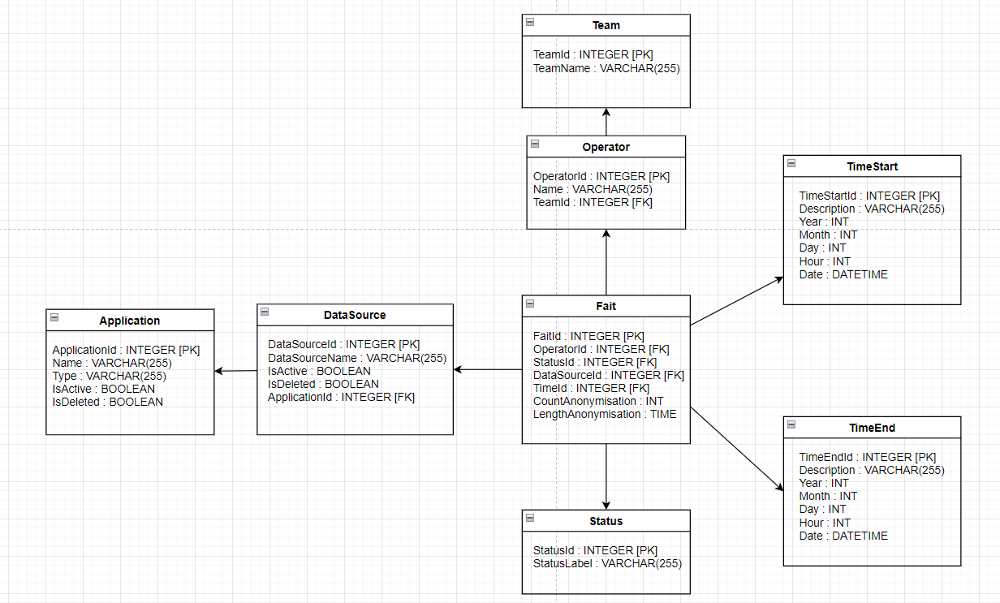

# TD 2

Model:  



## SQL request

1) averg over execution time per application on february 2024 where the status was "OK"


```SQL 
select Application.ApplicationId, avg(TimeEnd.DateTime - TimeStart.DateTime) as AvgDuration
from Fait 
join Status on Fait.StatusId = Status.StatusId
join DataSource on Fait.DataSourceId = DataSource.DataSourceId
join Application on DataSource.ApplicationId = Application.ApplicationId 
join TimeStart on Fait.TimeStartId = TimeStart.TimeStartId
join TimeEnd on Fait.TimeEndId = TimeEnd.TimeEndId
where Status.StatusLabel = 'OK'
and TimeStart.Month = 'February'
and TimeEnd.Month = 'February'
group by Application.ApplicationId
```

2) liste de application that have a no execution "KO" in February 2024 March 2024
```SQL 
select Application.ApplicationId, 
from Fait 
join Status on Fait.StatusId = Status.StatusId
join DataSource on Fait.DataSourceId = DataSource.DataSourceId
join Application on DataSource.ApplicationId = Application.ApplicationId 
join TimeStart on Fait.TimeStartId = TimeStart.TimeStartId
join TimeEnd on Fait.TimeEndId = TimeEnd.TimeEndId
where TimeStart.Month in ('February', 'March')
and TimeEnd.Month in ('February', 'March')
group by Application.ApplicationId
having COUNT(CASE WHEN Status.StatusLabel = 'KO' THEN 1 END) = 0


```
3) operators which more than 50 executions in mai2024
```SQL 
Select Operator.OperatorId
from Fait
join Operator on Fait.OperatorId = Operator.OperatorId
join TimeStart on Fait.TimeStartId = TimeStart.TimeStartId
GROUP BY Operator.OperatorId
HAVING COUNT(TimeStart.TimeStartId) > 50;
```

## Create tables

```SQL
CREATE TABLE groupe2.Team_Operateur (
   Id_Team_Operateur INT PRIMARY KEY,
   Nom_Team VARCHAR(255)
);

CREATE TABLE groupe2.Operateur (
   Id_Operateur INT PRIMARY KEY,
   Nom_Operateur VARCHAR(255),
   Id_Team_Operateur INT,
   FOREIGN KEY (Id_Team_Operateur) REFERENCES groupe2.Team_Operateur(Id_Team_Operateur)
);

CREATE TABLE groupe2.Date_Heure_Deb_Exec (
   Id_date_heure_deb_exec SERIAL PRIMARY KEY,
   Annee_exec INT,
   Mois_exec INT,
   Jour_exec INT,
   Heure_exec INT,
   Date_heure_exec DATE
);

CREATE TABLE groupe2.Date_Heure_Fin_Exec (
   Id_date_heure_fin_exec SERIAL PRIMARY KEY,
   Annee_exec INT,
   Mois_exec INT,
   Jour_exec INT,
   Heure_exec INT,
   Date_heure_exec DATE
);

CREATE TABLE groupe2.Application (
   Id_Application INT PRIMARY KEY,
   Nom_Application VARCHAR(255)
);

CREATE TABLE groupe2.Source_Donnee (
   Id_source_Donnee INT PRIMARY KEY,
   Id_Application_list VARCHAR(255),
   Nom_Source_Donnee VARCHAR(255),
   Type_Source_Donnee VARCHAR(255)
);

CREATE TABLE groupe2.Statut_Anon (
   Id_Statut_Anon INT PRIMARY KEY,
   Lib_Statut_Anon VARCHAR(255)
);

CREATE TABLE groupe2.Fait_Anon (
  Id_Operateur INT,
  Id_Statut_Anon INT,
  Id_source_Donnee INT,
  Id_date_heure_Deb_Exec INT,
  Id_date_heure_Fin_Exec INT,
  Nb_Anonymisation INT,
  Duree_Anonymisation DECIMAL,
  PRIMARY KEY (Id_Operateur, Id_Statut_Anon, Id_source_Donnee, Id_date_heure_Deb_Exec, Id_date_heure_Fin_Exec),
  FOREIGN KEY (Id_Operateur) REFERENCES groupe2.Operateur(Id_Operateur),
  FOREIGN KEY (Id_Statut_Anon) REFERENCES groupe2.Statut_Anon(Id_Statut_Anon),
  FOREIGN KEY (Id_source_Donnee) REFERENCES groupe2.Source_Donnee(Id_source_Donnee),
  FOREIGN KEY (Id_date_heure_Deb_Exec) REFERENCES groupe2.Date_Heure_Deb_Exec(Id_date_heure_deb_exec),
  FOREIGN KEY (Id_date_heure_Fin_Exec) REFERENCES groupe2.Date_Heure_Fin_Exec(Id_date_heure_fin_exec)
);
```

## Insert Data

### team_operateur

```SQL
INSERT INTO groupe2.team_operateur
(id_team_operateur, nom_team)
VALUES(0, 'Front');

INSERT INTO groupe2.team_operateur
(id_team_operateur, nom_team)
VALUES(1, 'Script');
```

### operateur

```SQL
INSERT INTO groupe2.operateur (Id_Operateur, Nom_Operateur, Id_Team_Operateur)
SELECT
   COALESCE(created_by_id, 0) AS Id_Operateur,
   'DefaultName' AS Nom_Operateur,
   CASE
       WHEN created_by_id IS NULL THEN 0
       ELSE 1
   END AS Id_Team_Operateur
FROM (
   SELECT created_by_id FROM dem_17.scan_dataentry
   UNION
   SELECT created_by_id FROM dem_17.scan_application
   UNION
   SELECT created_by_id FROM dem_17.scan_dataanonymisation
   UNION
   SELECT created_by_id FROM dem_17.scan_datasource
)
```

### statut

```SQL
INSERT INTO groupe2.statut_anon (id_statut_anon, lib_statut_anon)
SELECT DISTINCT
   status AS id_statut_anon,
   CASE
       WHEN status = 0 THEN 'Inconnu'
       WHEN status = 1 THEN 'En cours'
       WHEN status = 2 THEN 'OK'
       WHEN status = 3 THEN 'KO'
       ELSE 'Non défini'
   END AS lib_statut_anon
FROM dem_17.scan_dataentry;
```

### date_heure_deb_exec

```SQL
INSERT INTO groupe2.date_heure_deb_exec (Annee_exec, Mois_exec, Jour_exec, Heure_exec, Date_heure_exec)
SELECT DISTINCT ON (Annee_exec, Mois_exec, Jour_exec, Date_heure_exec)
   EXTRACT(YEAR FROM start_date) AS Annee_exec,
   EXTRACT(MONTH FROM start_date) AS Mois_exec,
   EXTRACT(DAY FROM start_date) AS Jour_exec,
   EXTRACT(HOUR FROM start_date) AS Heure_exec, 
   Date(start_date) AS Date_heure_exec
FROM dem_17.scan_dataentry
WHERE start_date IS NOT NULL
ORDER BY Annee_exec, Mois_exec, Jour_exec, Date_heure_exec, Heure_exec;
```

### date_heure_fin_exec

```SQL
INSERT INTO groupe2.date_heure_fin_exec (Annee_exec, Mois_exec, Jour_exec, Heure_exec, Date_heure_exec)
SELECT DISTINCT ON (Annee_exec, Mois_exec, Jour_exec, Date_heure_exec)
   EXTRACT(YEAR FROM end_date) AS Annee_exec,
   EXTRACT(MONTH FROM end_date) AS Mois_exec,
   EXTRACT(DAY FROM end_date) AS Jour_exec,
   EXTRACT(HOUR FROM end_date) AS Heure_exec,
   DATE(end_date) AS Date_heure_exec
FROM dem_17.scan_dataentry
WHERE end_date IS NOT NULL
ORDER BY Annee_exec, Mois_exec, Jour_exec, Date_heure_exec, Heure_exec;
```

### application

```SQL
INSERT INTO groupe2.application (id_application, nom_application)
SELECT id, name
FROM dem_17.scan_application;
```

### source_donnee

```SQL

INSERT INTO groupe2.source_donnee (id_source_donnee, nom_source_donnee, type_source_donnee)
SELECT
   Distinct ds.id AS id_source_donnee,                         
   COALESCE(ds.name, ds.reference) AS nom_source_donnee,
   de.extension AS type_source_donnee                
FROM
   dem_17.scan_datasource ds
JOIN
   dem_17.scan_dataentry de
   ON de.datasource_id = ds.id               
WHERE
   ds.id IS NOT NULL;
CREATE TEMP TABLE temp_datasource_applications_mapping (
   datasource_id INT PRIMARY KEY,
   application_ids TEXT
);
INSERT INTO temp_datasource_applications_mapping (datasource_id, application_ids)
SELECT
   datasource_id,
   string_agg(DISTINCT application_id::text, ',' ORDER BY application_id::text) AS application_ids
FROM
   dem_17.scan_application_data_sources
GROUP BY
   datasource_id
ORDER BY
   datasource_id;
UPDATE groupe2.source_donnee sd
SET id_application_list = tda.application_ids
FROM temp_datasource_applications_mapping tda
WHERE sd.id_source_donnee = tda.datasource_id;
DROP TABLE temp_datasource_applications_mapping;
```

### Fait

```SQL
INSERT INTO groupe2.fait_anon
(id_operateur, id_statut_anon, id_source_donnee, id_date_heure_deb_exec, id_date_heure_fin_exec, Nb_Anonymisation, Duree_Anonymisation )
SELECT
de.created_by_id,
de.status,
de.datasource_id,
ds.id_date_heure_deb_exec,
df.id_date_heure_fin_exec,
count(*) as Nb_Anonymisation,
CAST(AVG(EXTRACT(EPOCH FROM (de.end_date - de.start_date))) AS DECIMAL) AS Duration
from dem_17.scan_dataentry as de
JOIN
   groupe2.Date_Heure_Deb_Exec ds
   ON DATE(de.start_date) = ds.Date_heure_exec 
join
	groupe2.Date_Heure_Fin_Exec df
   ON DATE(de.end_date) = df.Date_heure_exec
where de.datasource_id is not null
group by de.created_by_id,
de.status,
de.datasource_id,
ds.id_date_heure_deb_exec,
df.id_date_heure_fin_exec
```