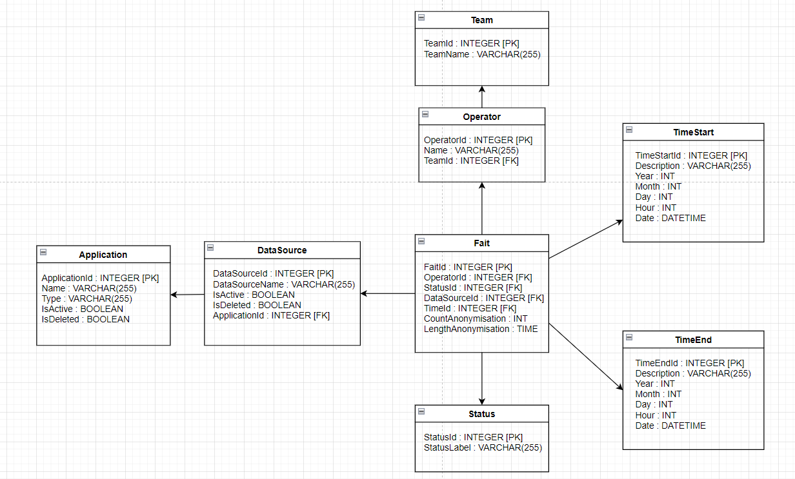

# TD 1

## Model correction

Considerations:

- The lines of the facttable change depending on what aggregation level are chosen
- time dimensions need to be defined (which granularity)
- do never put % in the facttable. It can always be recalculated
- never take the averages of other averages, always take all the samples and average over them
- **Conformity** can not be answered in this case
- Most fine grained granulaity should be added to the fact table
- there can be an additional dimension `anonymisation` with all additional infos (ex: start, end, error code, data, etc...)





## SQL request

1) averg over execution time per application on february 2024 where the status was "OK"


```SQL 
select Application.ApplicationId, avg(TimeEnd.DateTime - TimeStart.DateTime) as AvgDuration
from Fait 
join Status on Fait.StatusId = Status.StatusId
join DataSource on Fait.DataSourceId = DataSource.DataSourceId
join Application on DataSource.ApplicationId = Application.ApplicationId 
join TimeStart on Fait.TimeStartId = TimeStart.TimeStartId
join TimeEnd on Fait.TimeEndId = TimeEnd.TimeEndId
where Status.StatusLabel = 'OK'
and TimeStart.Month = 'February'
and TimeEnd.Month = 'February'
group by Application.ApplicationId
```

2) liste de application that have a no execution "KO" in February 2024 March 2024
```SQL 
select Application.ApplicationId, 
from Fait 
join Status on Fait.StatusId = Status.StatusId
join DataSource on Fait.DataSourceId = DataSource.DataSourceId
join Application on DataSource.ApplicationId = Application.ApplicationId 
join TimeStart on Fait.TimeStartId = TimeStart.TimeStartId
join TimeEnd on Fait.TimeEndId = TimeEnd.TimeEndId
where TimeStart.Month in ('February', 'March')
and TimeEnd.Month in ('February', 'March')
group by Application.ApplicationId
having COUNT(CASE WHEN Status.StatusLabel = 'KO' THEN 1 END) = 0


```
3) operators which more than 50 executions in mai2024
```SQL 
Select Operator.OperatorId
from Fait
join Operator on Fait.OperatorId = Operator.OperatorId
join TimeStart on Fait.TimeStartId = TimeStart.TimeStartId
GROUP BY Operator.OperatorId
HAVING COUNT(TimeStart.TimeStartId) > 50;
```